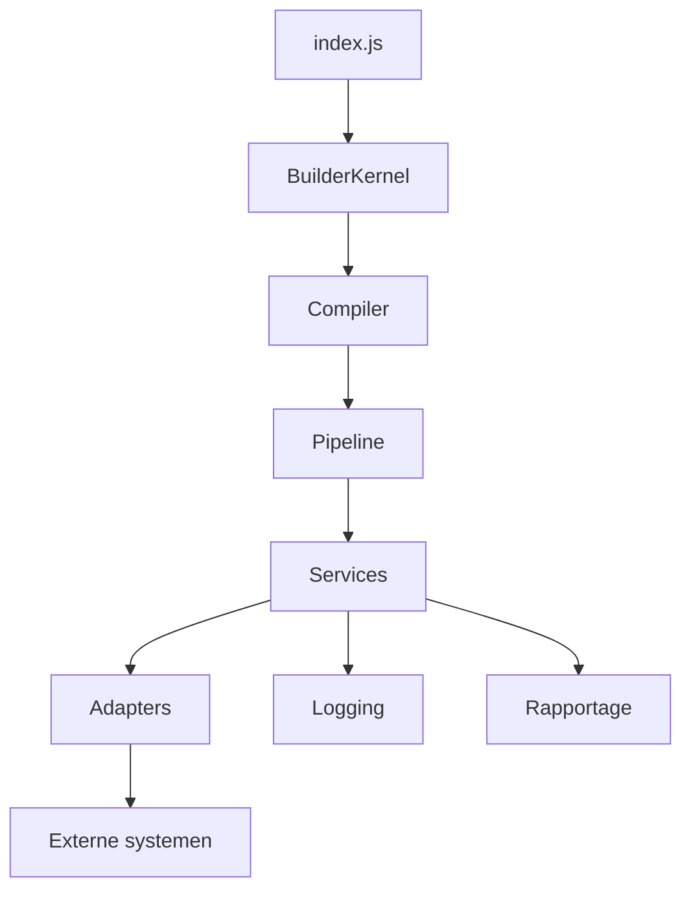
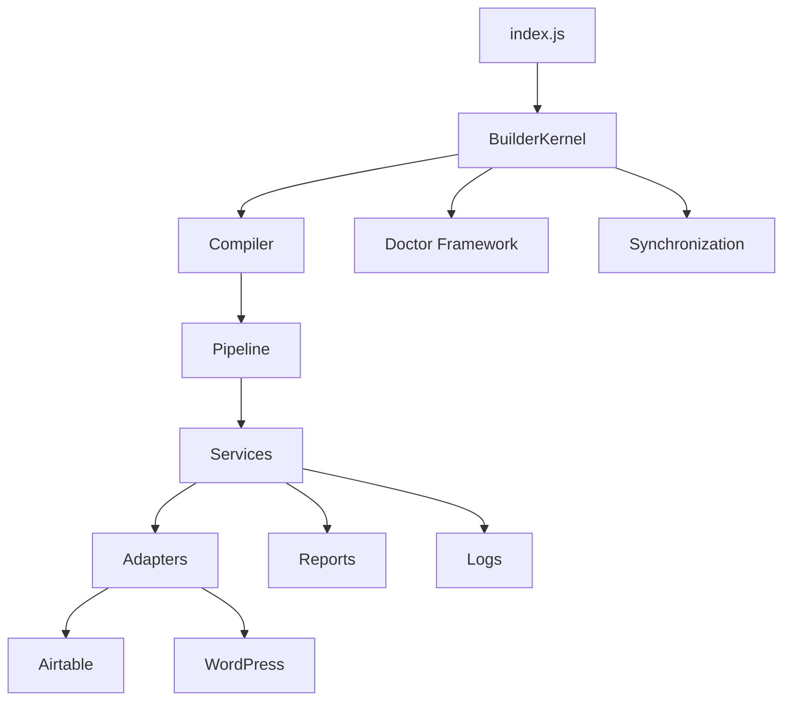

<!-- ========================================================================== -->
<!-- RZD Builder                                                                -->
<!-- ARCHITECTURE                                                               -->
<!-- ========================================================================== -->

# ARCHITECTURE

| Eigenschap | Waarde |
|------------|--------|
| Document | ARCHITECTURE.md |
| Project | RZD Builder |
| Versie | 2.0 |
| Status | Actief |
| Laatste wijziging | 29-07-2026 |
| Eigenaar | Pascalle Vroegop |
| **Rol** | **Leidend architectuurdocument** |


## Gerelateerde documentatie

Voor een volledig begrip van RZD Builder wordt aanbevolen de volgende documenten te raadplegen:

- README.md – Centrale ingang van de documentatiesuite.
- PROJECT_STATUS.md – Actuele projectstatus en prioriteiten.
- AI_RULES.md – Ontwikkelrichtlijnen voor AI-assistenten en ontwikkelaars.
- BACKLOG.md – Openstaande werkzaamheden en geplande ontwikkelingen.
- CHANGELOG.md – Overzicht van alle functionele en technische wijzigingen.

---

# Inhoud

1. Architectuuroverzicht
2. Ontwerpprincipes
3. Systeemarchitectuur
4. RZD Datamodel
5. Projectstructuur
6. BuilderKernel
7. Compiler
8. Pipeline
9. Services
10. Adapters
11. Modules
12. Metadata
13. Synchronisatie
14. Logging
15. Foutafhandeling
16. Testing
17. Uitbreidbaarheid
18. Toekomstvisie
19. Referenties

<!-- ========================================================================== -->
<!-- HOOFDSTUK 1                                                                -->
<!-- ARCHITECTUUROVERZICHT                                                      -->
<!-- ========================================================================== -->

# Hoofdstuk 1 – Architectuuroverzicht

## Doel

RZD Builder is een modulair softwareplatform dat is ontwikkeld voor het beheren, valideren, verwerken en synchroniseren van gegevens binnen het Reizen zonder Drempels (RZD)-project.

Het platform vormt de centrale bouwomgeving voor het samenstellen, controleren en publiceren van gegevens naar externe systemen zoals Airtable en WordPress. Door de modulaire opzet kunnen nieuwe functionaliteiten en integraties worden toegevoegd zonder ingrijpende wijzigingen aan de bestaande architectuur.

---

## Architectuurvisie

Bij het ontwerp van RZD Builder staan onderhoudbaarheid, uitbreidbaarheid en betrouwbaarheid centraal.

De software is opgebouwd uit zelfstandige componenten die elk een duidelijk afgebakende verantwoordelijkheid hebben. Hierdoor blijven wijzigingen lokaal, neemt de testbaarheid toe en kan het platform gecontroleerd doorgroeien.

Belangrijke ontwerpprincipes zijn:

- modulaire architectuur;
- scheiding van verantwoordelijkheden;
- metadata-gestuurde verwerking;
- herbruikbare componenten;
- uitbreidbaarheid zonder grote refactoring.

---

## Kerncomponenten

De belangrijkste onderdelen van de architectuur zijn:

- BuilderKernel
- Compiler
- Pipeline
- Services
- Adapters
- Modules
- Metadata
- Synchronisatie
- Logging
- Rapportage

Iedere component heeft een eigen verantwoordelijkheid en communiceert via duidelijke interfaces met de overige onderdelen van het systeem.

---

## Architectuuroverzicht

De globale gegevensstroom binnen RZD Builder ziet er als volgt uit:



In de volgende hoofdstukken worden alle componenten afzonderlijk beschreven.

<!-- ========================================================================== -->
<!-- HOOFDSTUK 2                                                                -->
<!-- ONTWERPPRINCIPES                                                           -->
<!-- ========================================================================== -->

# Hoofdstuk 2 – Ontwerpprincipes

## Inleiding

RZD Builder is ontworpen volgens een aantal vaste architectuurprincipes. Deze principes vormen de basis voor alle bestaande en toekomstige onderdelen van het systeem.

Door deze uitgangspunten consequent toe te passen blijft de software overzichtelijk, onderhoudbaar en eenvoudig uit te breiden.

---

## 2.1 Modulaire architectuur

Het systeem bestaat uit zelfstandige modules met een duidelijk afgebakende verantwoordelijkheid.

Elke module kan afzonderlijk worden ontwikkeld, getest en onderhouden zonder ongewenste afhankelijkheden naar andere onderdelen van het systeem.

---

## 2.2 Single Responsibility Principle

Iedere component heeft precies één primaire verantwoordelijkheid.

Voorbeelden:

- BuilderKernel verzorgt de centrale aansturing.
- Compiler verwerkt de invoer.
- Pipeline voert de verwerkingsstappen uit.
- Services bevatten de bedrijfslogica.
- Adapters verzorgen communicatie met externe systemen.

---

## 2.3 Metadata boven hardcoded logica

Waar mogelijk wordt gedrag bepaald door configuratie en metadata in plaats van hardcoded waarden.

Voordelen:

- minder programmeerwerk;
- eenvoudiger onderhoud;
- grotere flexibiliteit;
- minder kans op fouten.

---

## 2.4 Losse koppeling

Componenten communiceren uitsluitend via duidelijke interfaces.

Hierdoor kunnen onderdelen onafhankelijk worden aangepast of vervangen zonder grote gevolgen voor de rest van het systeem.

---

## 2.5 Herbruikbaarheid

Functionaliteit wordt zoveel mogelijk centraal ontwikkeld zodat code op meerdere plaatsen kan worden gebruikt.

Duplicatie van code wordt zoveel mogelijk voorkomen.

---

## 2.6 Testbaarheid

Nieuwe onderdelen moeten zelfstandig getest kunnen worden.

Waar mogelijk worden afhankelijkheden geïnjecteerd zodat componenten eenvoudig kunnen worden getest.

---

## 2.7 Uitbreidbaarheid

Nieuwe functionaliteit moet kunnen worden toegevoegd zonder bestaande componenten ingrijpend aan te passen.

Nieuwe connectors, builders en pipelines moeten volgens dezelfde architectuur kunnen worden geïntegreerd.

---

## 2.8 Consistentie

Alle onderdelen volgen dezelfde afspraken voor:

- naamgeving;
- logging;
- foutafhandeling;
- documentatie;
- projectstructuur.

---

## 2.9 Documentation First

Documentatie vormt een integraal onderdeel van de architectuur van RZD Builder.

Architectuur, broncode en documentatie worden als één samenhangend geheel ontwikkeld en onderhouden. Een ontwikkelingstaak wordt pas als afgerond beschouwd wanneer de bijbehorende documentatie is bijgewerkt.

Daarom gelden de volgende uitgangspunten:

- architectuurwijzigingen worden gelijktijdig gedocumenteerd;
- documentatie heeft dezelfde prioriteit als broncode;
- architectuurdocumentatie is de primaire bron voor ontwerpbeslissingen;
- wijzigingen worden geregistreerd in CHANGELOG.md;
- de actuele projectstatus wordt bijgewerkt in PROJECT_STATUS.md;
- ontwikkelsessies worden afgesloten met een bijgewerkt CHECKPOINT.md.

---

## Samenvatting

Deze ontwerpprincipes vormen de technische basis van RZD Builder.

Alle toekomstige uitbreidingen worden aan deze uitgangspunten getoetst om de kwaliteit, onderhoudbaarheid en schaalbaarheid van het platform te waarborgen.


<!-- ========================================================================== -->
<!-- HOOFDSTUK 3                                                                -->
<!-- SYSTEEMARCHITECTUUR                                                        -->
<!-- ========================================================================== -->

# Hoofdstuk 3 – Systeemarchitectuur

## Inleiding

RZD Builder is opgebouwd volgens een gelaagde architectuur. Iedere laag heeft een duidelijk afgebakende verantwoordelijkheid en communiceert uitsluitend met aangrenzende componenten.

Hierdoor blijft de software overzichtelijk, eenvoudig uitbreidbaar en goed testbaar.

---

## Architectuuroverzicht



---

## Architectuurlagen

### Applicatielaag

Bestaat uit de startpunten van de applicatie.

Voorbeelden:

- index.js
- CLI
- toekomstige API

---

### Orchestratielaag

De BuilderKernel vormt het centrale hart van het systeem.

Taken:

- workflow starten;
- configuratie laden;
- compiler aanroepen;
- pipeline starten;
- logging initiëren;
- synchronisatie aansturen.

---

### Verwerkingslaag

De Compiler verwerkt alle invoer en bouwt interne modellen op.

Daarna neemt de Pipeline de verwerking over.

---

### Servicelaag

Services bevatten alle bedrijfslogica.

Voorbeelden:

- MetadataService
- UpdateService
- ComparisonService
- ValidationService

---

### Adapterlaag

Adapters verzorgen de communicatie met externe systemen.

Momenteel:

- Airtable
- WordPress

Toekomstig:

- REST API's
- Databases
- CSV
- JSON
- XML

---

### Rapportagelaag

Na iedere uitvoering worden rapportages samengesteld.

Voorbeelden:

- validatie
- synchronisatie
- fouten
- logging
- statistieken

---

## Gegevensstroom

De verwerking verloopt in onderstaande volgorde.

1. index.js start de Builder.
2. BuilderKernel initialiseert het systeem.
3. Compiler bouwt de interne representatie.
4. Pipeline voert de verwerking uit.
5. Services verwerken de bedrijfslogica.
6. Adapters communiceren met externe systemen.
7. Rapportages worden gegenereerd.
8. Logging wordt opgeslagen.

---

## Voordelen

Deze architectuur biedt:

- duidelijke verantwoordelijkheden;
- hoge onderhoudbaarheid;
- eenvoudige uitbreidbaarheid;
- goede testbaarheid;
- minimale afhankelijkheden;
- consistente gegevensverwerking.


<!-- ========================================================================== -->
<!-- HOOFDSTUK 4                                                                -->
<!-- RZD DATAMODEL                                                              -->
<!-- ========================================================================== -->

# Hoofdstuk 4 – RZD Datamodel

<!-- ========================================================================== -->
<!-- HOOFDSTUK 5                                                                -->
<!-- PROJECTSTRUCTUUR                                                           -->
<!-- ========================================================================== -->

# Hoofdstuk 5 – Projectstructuur

## Inleiding

De broncode van RZD Builder is georganiseerd volgens een modulaire projectstructuur. Iedere map heeft een eigen verantwoordelijkheid en bevat componenten die logisch bij elkaar horen.

Deze structuur maakt het eenvoudiger om functionaliteit terug te vinden, wijzigingen door te voeren en nieuwe onderdelen toe te voegen zonder de bestaande architectuur te verstoren.

---

## Structuuroverzicht

```text
RZD Builder
│
├── compiler/
├── core/
├── builders/
├── services/
├── adapters/
├── modules/
├── config/
├── tools/
├── reports/
├── generated/
├── docs/
├── tests/
├── scripts/
│
├── README.md
├── LICENSE
└── package.json
```

> De exacte inhoud kan per release verschillen. Nieuwe componenten worden toegevoegd volgens dezelfde architectuurprincipes.

---

## compiler/

Bevat de compiler die invoer verwerkt en omzet naar een interne representatie die door de Pipeline kan worden verwerkt.

Verantwoordelijkheden:

- parserlogica;
- validatie van invoer;
- opbouw van interne modellen.

---

## core/

Bevat de kern van het platform.

Hier bevinden zich onder andere:

- BuilderKernel;
- gedeelde basisfunctionaliteit;
- centrale configuratie en orkestratie.

---

## builders/

Bevat gespecialiseerde builders die verantwoordelijk zijn voor het opbouwen van specifieke onderdelen van het systeem.

Nieuwe builders kunnen worden toegevoegd zonder bestaande builders te wijzigen.

---

## services/

Bevat de bedrijfslogica van het platform.

Voorbeelden:

- UpdateService;
- ValidationService;
- MetadataService;
- ComparisonService.

Services communiceren met elkaar via duidelijke interfaces.

---

## adapters/

Adapters verzorgen de communicatie met externe systemen.

Voorbeelden:

- Airtable;
- WordPress;
- toekomstige REST API's.

Adapters bevatten geen bedrijfslogica, maar vertalen gegevens van en naar externe systemen.

---

## modules/

Zelfstandige uitbreidingen die aanvullende functionaliteit leveren.

Modules kunnen onafhankelijk worden ontwikkeld en onderhouden.

---

## config/

Bevat configuratiebestanden die het gedrag van de applicatie bepalen.

Configuratie staat los van de broncode zodat instellingen per omgeving kunnen verschillen.

---

## tools/

Ondersteunende hulpmiddelen voor ontwikkeling, onderhoud en beheer.

Bijvoorbeeld:

- hulpprogramma's;
- migratiescripts;
- analyse- en onderhoudstools.

---

## reports/

Automatisch gegenereerde rapportages.

Voorbeelden:

- validatierapporten;
- synchronisatierapporten;
- foutoverzichten.

---

## generated/

Bestanden die tijdens het build- of synchronisatieproces automatisch worden aangemaakt.

Deze bestanden worden niet handmatig aangepast.

---

## docs/

Projectdocumentatie, architectuur, roadmap en overige technische documentatie.

---

## tests/

Bevat alle geautomatiseerde tests.

Denk aan:

- unit tests;
- integratietests;
- regressietests.

---

## scripts/

Scripts voor ontwikkel- en releaseprocessen.

Bijvoorbeeld:

- build;
- release;
- onderhoud;
- migraties.

---

## Samenvatting

Door de duidelijke scheiding van verantwoordelijkheden blijft de projectstructuur overzichtelijk en schaalbaar. Nieuwe functionaliteit kan worden toegevoegd zonder bestaande componenten ingrijpend te wijzigen.


<!-- ========================================================================== -->
<!-- HOOFDSTUK 6                                                                -->
<!-- BUILDERKERNEL                                                              -->
<!-- ========================================================================== -->

# Hoofdstuk 6 – BuilderKernel

## Doel

De BuilderKernel vormt het centrale coördinatiepunt van RZD Builder. Alle belangrijke processen worden vanuit de BuilderKernel gestart, bewaakt en gecontroleerd.

De BuilderKernel bevat zelf zo min mogelijk bedrijfslogica. In plaats daarvan stuurt hij de verschillende componenten aan en bewaakt hij de volledige workflow.

---

## Verantwoordelijkheden

De BuilderKernel is verantwoordelijk voor:

- initialiseren van het systeem;
- laden van configuratie;
- starten van de Compiler;
- starten van de Pipeline;
- aansturen van Services;
- initiëren van synchronisaties;
- verzamelen van rapportages;
- centrale foutafhandeling;
- logging van de workflow.

---

## Positie binnen de architectuur

```text
index.js
     │
     ▼
BuilderKernel
     │
     ├── Compiler
     ├── Pipeline
     ├── Services
     ├── Synchronisatie
     └── Rapportages
```

---

## Workflow

Tijdens een normale uitvoering verloopt de verwerking als volgt:

1. Initialisatie.
2. Configuratie laden.
3. Compiler starten.
4. Pipeline uitvoeren.
5. Services aanroepen.
6. Synchronisatie uitvoeren.
7. Rapportages genereren.
8. Afronden.

---

## Afhankelijkheden

De BuilderKernel is afhankelijk van:

- configuratie;
- Compiler;
- Pipeline;
- Services;
- Logging;
- Rapportages.

De BuilderKernel is niet afhankelijk van specifieke adapters zoals Airtable of WordPress. Hierdoor blijft de kernel onafhankelijk van externe systemen.

---

## Ontwerpprincipes

De BuilderKernel volgt de volgende ontwerpregels:

- geen bedrijfslogica;
- geen hardcoded gegevens;
- minimale afhankelijkheden;
- centrale orkestratie;
- uitbreidbaar via modules.

---

## Toekomstige uitbreidingen

De BuilderKernel is voorbereid op toekomstige functionaliteit zoals:

- parallelle verwerking;
- meerdere pipelines;
- plugin-ondersteuning;
- taakplanning;
- event-driven verwerking;
- monitoring.

---

## Samenvatting

De BuilderKernel vormt het hart van RZD Builder. Door uitsluitend verantwoordelijk te zijn voor de coördinatie van processen blijft de architectuur overzichtelijk, schaalbaar en eenvoudig te onderhouden.


<!-- ========================================================================== -->
<!-- HOOFDSTUK 7                                                                -->
<!-- COMPILER                                                                   -->
<!-- ========================================================================== -->

# Hoofdstuk 7 – Compiler

## Doel

De Compiler is verantwoordelijk voor het verwerken van invoergegevens en het omzetten daarvan naar een gestandaardiseerde interne representatie die door de Pipeline kan worden verwerkt.

De Compiler fungeert als de vertaallaag tussen externe invoer en de interne architectuur van RZD Builder.

---

## Verantwoordelijkheden

De Compiler is verantwoordelijk voor:

- inlezen van brongegevens;
- controleren van de invoerstructuur;
- uitvoeren van basisvalidaties;
- normaliseren van gegevens;
- opbouwen van interne objecten;
- voorbereiden van gegevens voor de Pipeline.

---

## Positie binnen de architectuur

```text
BuilderKernel
      │
      ▼
   Compiler
      │
      ▼
   Pipeline
```

---

## Verwerkingsproces

Tijdens een compilatie worden de volgende stappen uitgevoerd:

1. Invoer laden.
2. Structuur controleren.
3. Basisvalidaties uitvoeren.
4. Gegevens normaliseren.
5. Interne objecten opbouwen.
6. Resultaat doorgeven aan de Pipeline.

---

## Input

De Compiler kan gegevens verwerken uit verschillende bronnen, zoals:

- configuratiebestanden;
- metadata;
- JSON;
- CSV;
- API-responses;
- toekomstige databronnen.

Nieuwe invoerformaten kunnen worden toegevoegd zonder de kern van de Compiler aan te passen.

---

## Output

De output van de Compiler bestaat uit een consistente interne gegevensstructuur die door de Pipeline verder kan worden verwerkt. Zie hoofdstuk 12 (Metadata) voor de beschrijving van de metadata waarop de Compiler zich baseert.

Hierdoor hoeft de Pipeline geen kennis te hebben van de oorspronkelijke bron of het formaat van de invoer.

---

## Foutafhandeling

Tijdens de compilatie worden fouten en waarschuwingen verzameld.

Voorbeelden:

- ontbrekende verplichte velden;
- ongeldige waarden;
- onbekende configuraties;
- onvolledige metadata.

Afhankelijk van de ernst kan de verwerking worden voortgezet of gecontroleerd worden afgebroken.

---

## Ontwerpprincipes

De Compiler volgt de volgende uitgangspunten:

- brononafhankelijk;
- geen bedrijfslogica;
- reproduceerbare verwerking;
- consistente output;
- duidelijke foutmeldingen.

---

## Toekomstige uitbreidingen

De architectuur biedt ruimte voor onder andere:

- ondersteuning van extra bestandsformaten;
- incrementele compilatie;
- parallelle verwerking;
- caching van compilatieresultaten;
- uitbreidbare parsermodules.

---

## Samenvatting

De Compiler vormt de vertaallaag tussen externe gegevensbronnen en de interne verwerking. Door invoer te normaliseren en te standaardiseren levert de Compiler een betrouwbare basis voor de verdere verwerking binnen de Pipeline.


<!-- ========================================================================== -->
<!-- HOOFDSTUK 8                                                                -->
<!-- PIPELINE                                                                   -->
<!-- ========================================================================== -->

# Hoofdstuk 8 – Pipeline

## Doel

De Pipeline is verantwoordelijk voor het gecontroleerd uitvoeren van alle verwerkingsstappen binnen RZD Builder. Nadat de Compiler de gegevens heeft voorbereid, zorgt de Pipeline ervoor dat iedere stap in de juiste volgorde wordt uitgevoerd.

Door de verwerking op te delen in afzonderlijke fasen blijft de workflow overzichtelijk, uitbreidbaar en eenvoudig te testen.

---

## Verantwoordelijkheden

De Pipeline is verantwoordelijk voor:

- uitvoeren van verwerkingsstappen;
- bewaken van de uitvoervolgorde;
- doorgeven van gegevens tussen stappen;
- afhandelen van fouten;
- registreren van de voortgang;
- voorbereiden van synchronisatie en rapportage.

---

## Positie binnen de architectuur

```text
BuilderKernel
      │
      ▼
   Compiler
      │
      ▼
   Pipeline
      │
      ▼
   Services
      │
      ▼
   Adapters
```

---

## Verwerkingsfasen

Een standaard Pipeline bestaat uit de volgende fasen:

1. Initialisatie
2. Validatie
3. Normalisatie
4. Verrijking van gegevens
5. Bedrijfslogica uitvoeren
6. Synchronisatie voorbereiden
7. Rapportages genereren
8. Afronding

De verwerking maakt gebruik van metadata zoals beschreven in hoofdstuk 12.

Afhankelijk van de configuratie kunnen stappen worden toegevoegd, verwijderd of vervangen.

---

## Pipeline-stappen

Iedere stap in de Pipeline heeft een vaste structuur:

- ontvangt invoer;
- verwerkt de gegevens;
- retourneert uitvoer;
- registreert eventuele fouten;
- geeft de verwerking door aan de volgende stap.

Hierdoor zijn stappen onafhankelijk van elkaar en eenvoudig herbruikbaar.

---

## Foutafhandeling

Wanneer een stap een fout detecteert, bepaalt de Pipeline op basis van de configuratie hoe hiermee wordt omgegaan.

Mogelijke acties:

- waarschuwing registreren;
- stap overslaan;
- verwerking voortzetten;
- verwerking gecontroleerd beëindigen.

Alle fouten worden centraal vastgelegd in de rapportage.

---

## Ontwerpprincipes

De Pipeline is gebaseerd op de volgende uitgangspunten:

- vaste uitvoervolgorde;
- onafhankelijke verwerkingsstappen;
- uitbreidbare architectuur;
- minimale onderlinge afhankelijkheden;
- reproduceerbare verwerking.

---

## Toekomstige uitbreidingen

De architectuur maakt onder andere de volgende uitbreidingen mogelijk:

- dynamische pipelines;
- parallelle verwerking;
- conditionele stappen;
- plugins voor extra verwerkingsfasen;
- herstarten vanaf een tussenstap;
- monitoring van prestaties.

---

## Samenvatting

De Pipeline vormt de gecontroleerde verwerkingslaag van RZD Builder. Door gegevens stap voor stap te verwerken volgens een vaste workflow ontstaat een robuuste, schaalbare en onderhoudbare architectuur die eenvoudig kan worden uitgebreid met nieuwe functionaliteit.


<!-- ========================================================================== -->
<!-- HOOFDSTUK 9                                                                -->
<!-- SERVICES                                                                   -->
<!-- ========================================================================== -->

# Hoofdstuk 9 – Services

## Doel

Services bevatten de bedrijfslogica van RZD Builder. Zij voeren de functionele verwerking van gegevens uit en zorgen ervoor dat alle bedrijfsregels op een consistente manier worden toegepast.

Services vormen de schakel tussen de Pipeline en de Adapters. Zij verwerken gegevens, voeren controles uit en bereiden informatie voor op synchronisatie of rapportage.

---

## Verantwoordelijkheden

Services zijn verantwoordelijk voor:

- uitvoeren van bedrijfsregels;
- verwerken van metadata;
- uitvoeren van validaties;
- vergelijken van gegevens;
- voorbereiden van synchronisaties;
- genereren van tussenresultaten.

---

## Positie binnen de architectuur

```text
Pipeline
     │
     ▼
 Services
     │
     ▼
 Adapters
```

---

## Opbouw van een Service

Iedere Service heeft één duidelijke verantwoordelijkheid.

Een Service:

- ontvangt gegevens;
- verwerkt de gegevens;
- retourneert een resultaat;
- kent geen gebruikersinterface;
- communiceert uitsluitend via goed gedefinieerde interfaces.

Hierdoor blijven Services onafhankelijk en goed testbaar.

---

## Voorbeelden van Services

### MetadataService

Verwerkt metadata en zorgt voor een uniforme interpretatie van configuratie en definities.

---

### ValidationService

Controleert gegevens op volledigheid, juistheid en consistentie.

Voorbeelden:

- verplichte velden;
- datatypecontroles;
- referentiële controles;
- business rules.

---

### UpdateService

Bepaalt welke gegevens gewijzigd moeten worden en bereidt updates voor.

---

### ComparisonService

Vergelijkt bestaande gegevens met nieuwe gegevens om verschillen vast te stellen.

Deze informatie wordt gebruikt voor synchronisatie en rapportages.

---

### Toekomstige Services

De architectuur biedt ruimte voor aanvullende Services, zoals:

- CacheService;
- NotificationService;
- StatisticsService;
- ExportService;
- ImportService;
- AuditService.

Nieuwe Services kunnen worden toegevoegd zonder bestaande Services aan te passen.

---

## Ontwerpprincipes

Iedere Service voldoet aan de volgende uitgangspunten:

- één verantwoordelijkheid;
- geen directe afhankelijkheid van externe systemen;
- herbruikbaar;
- goed testbaar;
- duidelijke input en output;
- geen verborgen neveneffecten.

---

## Samenwerking

Services communiceren niet rechtstreeks met externe systemen. De communicatie met externe systemen verloopt uitsluitend via de Adapterlaag (zie hoofdstuk 10).

Alle communicatie verloopt via de daarvoor bestemde Adapters.

Hierdoor blijft de bedrijfslogica volledig gescheiden van technische implementaties.

---

## Foutafhandeling

Services registreren fouten en waarschuwingen, maar bepalen niet zelfstandig hoe deze worden afgehandeld.

De uiteindelijke afhandeling ligt bij de Pipeline en de BuilderKernel.

---

## Samenvatting

Services vormen het functionele hart van RZD Builder. Door bedrijfslogica te centraliseren in zelfstandige Services blijft de software overzichtelijk, onderhoudbaar en eenvoudig uit te breiden.


<!-- ========================================================================== -->
<!-- HOOFDSTUK 10                                                               -->
<!-- ADAPTERS                                                                   -->
<!-- ========================================================================== -->

# Hoofdstuk 10 – Adapters

## Doel

Adapters vormen de communicatielaag tussen RZD Builder en externe systemen. Zij vertalen interne gegevensstructuren naar het formaat dat een extern systeem verwacht en omgekeerd. De synchronisatieprocessen waarin Adapters worden gebruikt, zijn beschreven in hoofdstuk 13.

Door deze scheiding blijft de kern van RZD Builder onafhankelijk van specifieke API's, databases of andere externe diensten.

---

## Verantwoordelijkheden

Adapters zijn verantwoordelijk voor:

- verzenden van gegevens;
- ontvangen van gegevens;
- vertalen van interne modellen naar externe formaten;
- afhandelen van API-communicatie;
- verwerken van technische fouten;
- beheren van authenticatie en verbindingen.

Adapters bevatten **geen bedrijfslogica**. Zij richten zich uitsluitend op de technische communicatie.

---

## Positie binnen de architectuur

```text
Pipeline
     │
     ▼
 Services
     │
     ▼
 Adapters
     │
     ▼
 Externe systemen
```

---

## Ondersteunde systemen

De architectuur ondersteunt onder andere:

- Airtable;
- WordPress;
- REST API's;
- JSON-services;
- CSV-import en -export.

Nieuwe systemen kunnen worden toegevoegd door een nieuwe Adapter te implementeren.

---

## Werkwijze

Een Adapter voert doorgaans de volgende stappen uit:

1. Ontvangt een intern gegevensmodel.
2. Zet de gegevens om naar het vereiste formaat.
3. Verzendt of ontvangt gegevens.
4. Verwerkt technische fouten.
5. Retourneert een gestandaardiseerd resultaat.

Hierdoor blijft de rest van het systeem onafhankelijk van technische details zoals HTTP-verzoeken of API-specifieke velden.

---

## Ontwerpprincipes

Iedere Adapter voldoet aan de volgende uitgangspunten:

- één verantwoordelijkheid;
- geen bedrijfslogica;
- duidelijke input en output;
- herbruikbare implementatie;
- consistente foutafhandeling;
- eenvoudig vervangbaar.

---

## Foutafhandeling

Technische fouten worden door de Adapter geregistreerd en doorgegeven aan de Pipeline of BuilderKernel.

Voorbeelden:

- netwerkfouten;
- time-outs;
- authenticatiefouten;
- API-limieten;
- ongeldige responses.

De Adapter bepaalt niet hoe de fout functioneel wordt afgehandeld.

---

## Toekomstige uitbreidingen

De Adapterlaag is ontworpen om eenvoudig uit te breiden met nieuwe koppelingen, zoals:

- SQL-databases;
- NoSQL-opslag;
- cloudopslag;
- GraphQL API's;
- message queues;
- externe validatiediensten.

---

## Samenvatting

Adapters zorgen voor een duidelijke scheiding tussen de interne architectuur van RZD Builder en externe systemen. Hierdoor blijft de kern van het platform stabiel, terwijl nieuwe integraties eenvoudig kunnen worden toegevoegd of vervangen.


<!-- ========================================================================== -->
<!-- HOOFDSTUK 11                                                               -->
<!-- MODULES                                                                    -->
<!-- ========================================================================== -->

# Hoofdstuk 11 – Modules

## Doel

Modules vormen de uitbreidbare onderdelen van RZD Builder. Iedere module voegt een afgebakende functionaliteit toe zonder wijzigingen aan de kern van het platform.

Dankzij deze modulaire opzet kan RZD Builder meegroeien met nieuwe wensen en integraties, terwijl de bestaande architectuur stabiel blijft.

---

## Verantwoordelijkheden

Een module is verantwoordelijk voor:

- uitvoeren van één specifieke functionaliteit;
- samenwerken met bestaande Services;
- communiceren via de beschikbare interfaces;
- leveren van een duidelijk resultaat;
- zelfstandig kunnen worden ontwikkeld en onderhouden.

---

## Positie binnen de architectuur

```text
BuilderKernel
      │
      ▼
   Pipeline
      │
      ▼
   Services
      │
      ▼
   Modules
      │
      ▼
   Adapters
```

---

## Eigenschappen van een Module

Een module:

- heeft één duidelijk doel;
- bevat geen centrale orkestratie;
- gebruikt bestaande Services waar mogelijk;
- kan onafhankelijk worden getest;
- heeft een duidelijke input en output;
- is eenvoudig uit te schakelen of te vervangen.

---

## Levenscyclus

Een module doorloopt de volgende fasen:

1. Registratie.
2. Initialisatie.
3. Uitvoering.
4. Resultaat retourneren.
5. Opruimen van tijdelijke resources.

De BuilderKernel bepaalt wanneer een module wordt uitgevoerd.

---

## Afhankelijkheden

Modules mogen afhankelijk zijn van:

- Services;
- configuratie;
- metadata;
- gedeelde hulpfuncties.

Modules mogen **niet** rechtstreeks afhankelijk zijn van andere modules, tenzij dit expliciet is ontworpen en gedocumenteerd.

---

## Voorbeelden

Mogelijke modules zijn:

- AccessibilityModule;
- SEOBuilderModule;
- MediaModule;
- ReviewModule;
- StatisticsModule;
- ReportModule;
- ExportModule.

Deze lijst is niet uitputtend en kan per release worden uitgebreid.

---

## Ontwerpprincipes

Iedere module voldoet aan de volgende uitgangspunten:

- één verantwoordelijkheid;
- minimale afhankelijkheden;
- herbruikbaarheid;
- uitbreidbaarheid;
- consistente foutafhandeling;
- duidelijke documentatie.

---

## Registratie

Nieuwe modules worden geregistreerd via de configuratie of een centraal registratiemechanisme.

Hierdoor hoeft de BuilderKernel niet te worden aangepast wanneer een nieuwe module wordt toegevoegd.

---

## Toekomstige uitbreidingen

De modulearchitectuur biedt ruimte voor:

- plugin-ondersteuning;
- dynamisch laden van modules;
- versiebeheer per module;
- optionele modules;
- community-uitbreidingen;
- externe extensies.

---

## Samenvatting

Modules maken RZD Builder flexibel en toekomstbestendig. Door nieuwe functionaliteit als zelfstandige module toe te voegen blijft de kern van het platform compact, stabiel en onderhoudbaar.


<!-- ========================================================================== -->
<!-- HOOFDSTUK 12                                                               -->
<!-- METADATA                                                                   -->
<!-- ========================================================================== -->

# Hoofdstuk 12 – Metadata

## Doel

Metadata vormt de centrale beschrijvende laag van RZD Builder. In plaats van gedrag vast te leggen in hardcoded programmatuur, worden eigenschappen, configuraties en verwerkingsregels zoveel mogelijk vastgelegd als metadata.

Hierdoor blijft de software flexibel, onderhoudbaar en eenvoudig uit te breiden zonder wijzigingen aan de kernarchitectuur.

---

## Rol binnen de architectuur

Metadata bepaalt hoe gegevens worden geïnterpreteerd en verwerkt.

Vrijwel alle onderdelen van RZD Builder maken gebruik van metadata, waaronder:

- Compiler
- Pipeline
- Services
- Modules
- Adapters
- Synchronisatie
- Rapportages

Hierdoor ontstaat één centrale bron van waarheid voor de verwerking van gegevens.

---

## Verantwoordelijkheden

Metadata beschrijft onder andere:

- velddefinities;
- gegevenstypen;
- validatieregels;
- standaardwaarden;
- afhankelijkheden;
- synchronisatieregels;
- relaties tussen objecten;
- configuratie-instellingen.

---

## Metadataflow

```text
Configuratie
      │
      ▼
 Metadata
      │
      ▼
 Compiler
      │
      ▼
 Pipeline
      │
      ▼
 Services
      │
      ▼
 Adapters
```

---

## Eigenschappen

Metadata is:

- centraal beheerd;
- herbruikbaar;
- uitbreidbaar;
- versieerbaar;
- onafhankelijk van bedrijfslogica.

Wijzigingen in metadata mogen geen wijzigingen aan de kernarchitectuur vereisen.

---

## Toepassingen

Metadata wordt gebruikt voor:

- validatie;
- mapping;
- synchronisatie;
- veldtransformaties;
- rapportages;
- configuratie;
- documentatie;
- toekomstige automatisering.

---

## Ontwerpprincipes

Metadata voldoet aan de volgende uitgangspunten:

- één centrale definitie;
- geen duplicatie;
- consistente naamgeving;
- uitbreidbaar zonder codewijzigingen;
- onafhankelijk van specifieke externe systemen.

---

## Versiebeheer

Metadata kan onafhankelijk van de software worden aangepast.

Hierdoor kunnen wijzigingen aan configuraties worden doorgevoerd zonder een nieuwe softwareversie uit te brengen, mits de wijzigingen compatibel zijn met de bestaande architectuur.

---

## Toekomstige uitbreidingen

De metadata-architectuur biedt ruimte voor:

- dynamische velddefinities;
- automatische validatie;
- configuratie per omgeving;
- meertalige definities;
- plugin-specifieke metadata;
- automatische documentatiegeneratie.

---

## Samenvatting

Metadata vormt de centrale kennislaag van RZD Builder. Door gedrag zoveel mogelijk te beschrijven met metadata in plaats van hardcoded logica ontstaat een flexibel, schaalbaar en onderhoudbaar platform dat eenvoudig kan meegroeien met nieuwe functionaliteit.


<!-- ========================================================================== -->
<!-- HOOFDSTUK 13                                                               -->
<!-- SYNCHRONISATIE                                                             -->
<!-- ========================================================================== -->

# Hoofdstuk 13 – Synchronisatie

## Doel

De synchronisatielaag is verantwoordelijk voor het uitwisselen van gegevens tussen RZD Builder en externe systemen. Hierbij wordt ervoor gezorgd dat gegevens consistent, betrouwbaar en controleerbaar worden bijgewerkt.

Synchronisatie vindt plaats via de Adapterlaag, zodat de kern van RZD Builder onafhankelijk blijft van de implementatie van externe systemen.

---

## Verantwoordelijkheden

De synchronisatielaag is verantwoordelijk voor:

- ophalen van gegevens;
- vergelijken van gegevens;
- bepalen van wijzigingen;
- uitvoeren van updates;
- registreren van resultaten;
- herstellen van tijdelijke synchronisatiefouten.

---

## Positie binnen de architectuur

```text
BuilderKernel
      │
      ▼
   Pipeline
      │
      ▼
   Services
      │
      ▼
   Synchronisatie
      │
      ▼
   Adapters
      │
      ▼
 Externe systemen
```

---

## Synchronisatieproces

Een standaard synchronisatie verloopt in de volgende stappen:

1. Verbinding maken met het externe systeem.
2. Huidige gegevens ophalen.
3. Vergelijken met de interne gegevens.
4. Wijzigingen bepalen.
5. Alleen noodzakelijke updates uitvoeren.
6. Resultaten registreren. Alle synchronisatieactiviteiten worden geregistreerd via de loggingvoorziening (zie hoofdstuk 14).
7. Rapportage genereren.

Hierdoor worden onnodige updates voorkomen en blijft de verwerking efficiënt.

---

## Synchronisatiestrategieën

Afhankelijk van de toepassing kunnen verschillende strategieën worden gebruikt:

- volledige synchronisatie;
- incrementele synchronisatie;
- eenrichtingssynchronisatie;
- tweerichtingssynchronisatie;
- handmatige synchronisatie;
- geplande synchronisatie.

De gekozen strategie wordt bepaald door configuratie en metadata.

---

## Consistentie

Tijdens synchronisatie gelden de volgende uitgangspunten:

- gegevensintegriteit staat voorop;
- dubbele updates worden voorkomen;
- conflicten worden geregistreerd;
- wijzigingen zijn reproduceerbaar;
- iedere synchronisatie is controleerbaar.

---

## Foutafhandeling

Bij technische of functionele fouten:

- wordt de fout geregistreerd;
- wordt de oorzaak gelogd;
- kan een herhaalpoging worden uitgevoerd;
- blijft de status van de synchronisatie inzichtelijk.

De synchronisatielaag beslist niet zelfstandig over bedrijfsregels; deze blijven onderdeel van de Services.

---

## Ontwerpprincipes

De synchronisatielaag voldoet aan de volgende uitgangspunten:

- brononafhankelijk;
- reproduceerbaar;
- uitbreidbaar;
- veilig;
- volledig gelogd;
- los gekoppeld van externe systemen.

---

## Toekomstige uitbreidingen

De architectuur ondersteunt toekomstige uitbreidingen zoals:

- real-time synchronisatie;
- webhook-ondersteuning;
- event-driven synchronisatie;
- batchverwerking;
- automatische conflictresolutie;
- synchronisatie met meerdere systemen tegelijk.

---

## Samenvatting

De synchronisatielaag zorgt voor een betrouwbare en gecontroleerde uitwisseling van gegevens tussen RZD Builder en externe systemen. Door gebruik te maken van duidelijke processen, metadata en adapters blijft de synchronisatie schaalbaar, controleerbaar en eenvoudig uit te breiden.


<!-- ========================================================================== -->
<!-- HOOFDSTUK 14                                                               -->
<!-- LOGGING                                                                    -->
<!-- ========================================================================== -->

# Hoofdstuk 14 – Logging

## Doel

Logging zorgt voor het vastleggen van gebeurtenissen tijdens de uitvoering van RZD Builder. Hierdoor kunnen processen worden gecontroleerd, fouten worden geanalyseerd en prestaties worden gemonitord.

Logging ondersteunt zowel de ontwikkeling als het beheer van het platform.

---

## Verantwoordelijkheden

De logginglaag is verantwoordelijk voor:

- registreren van gebeurtenissen;
- vastleggen van fouten;
- opslaan van waarschuwingen;
- meten van prestaties;
- ondersteunen van probleemanalyse;
- leveren van informatie voor rapportages.

---

## Logniveaus

RZD Builder gebruikt de volgende logniveaus:

- DEBUG
- INFO
- WARNING
- ERROR
- CRITICAL

Hierdoor kan de hoeveelheid loginformatie per omgeving worden afgestemd.

---

## Loggingproces

Tijdens de verwerking worden onder andere de volgende gebeurtenissen geregistreerd:

1. Start van de Builder.
2. Laden van configuratie.
3. Start en einde van Pipeline-stappen.
4. Synchronisaties.
5. Waarschuwingen.
6. Fouten.
7. Afronding van de uitvoering.

---

## Ontwerpprincipes

Logging voldoet aan de volgende uitgangspunten:

- consistent formaat;
- duidelijke tijdstempels;
- reproduceerbare informatie;
- minimale prestatie-impact;
- centraal beheer.

---

## Toekomstige uitbreidingen

De architectuur biedt ruimte voor:

- centrale logservers;
- realtime monitoring;
- dashboards;
- prestatieanalyses;
- automatische foutdetectie.

---

## Samenvatting

Logging maakt de werking van RZD Builder inzichtelijk en ondersteunt zowel foutanalyse als toekomstig beheer.


<!-- ========================================================================== -->
<!-- HOOFDSTUK 15                                                               -->
<!-- FOUTAFHANDELING                                                            -->
<!-- ========================================================================== -->

# Hoofdstuk 15 – Foutafhandeling

## Doel

Foutafhandeling zorgt ervoor dat onverwachte situaties gecontroleerd worden verwerkt zonder de stabiliteit van het platform onnodig in gevaar te brengen.

Het doel is om fouten zo vroeg mogelijk te detecteren, duidelijk te registreren en waar mogelijk gecontroleerd te herstellen.

---

## Verantwoordelijkheden

De foutafhandeling is verantwoordelijk voor:

- detecteren van fouten;
- classificeren van fouten;
- registreren van fouten;
- informeren van de BuilderKernel;
- veilig beëindigen of voortzetten van processen.

---

## Soorten fouten

Binnen RZD Builder worden verschillende categorieën onderscheiden:

- configuratiefouten;
- validatiefouten;
- synchronisatiefouten;
- netwerkfouten;
- interne programmeerfouten;
- onverwachte uitzonderingen.

---

## Afhandelingsproces

Bij een fout wordt de volgende werkwijze toegepast:

1. Fout detecteren.
2. Logregistratie uitvoeren.
3. Ernst bepalen.
4. Herstelpoging indien mogelijk.
5. Verwerking voortzetten of beëindigen.
6. Rapportage bijwerken.

---

## Ontwerpprincipes

De foutafhandeling voldoet aan de volgende uitgangspunten:

- duidelijke foutmeldingen;
- reproduceerbare situaties;
- geen verborgen fouten;
- gecontroleerd herstel;
- volledige registratie.

---

## Relatie met Logging

Iedere fout wordt automatisch geregistreerd via de centrale loggingvoorziening.

Hierdoor zijn fouten altijd terug te vinden tijdens analyse en onderhoud.

---

## Toekomstige uitbreidingen

De architectuur ondersteunt onder andere:

- automatische herstelstrategieën;
- foutclassificatie op ernst;
- notificaties;
- integratie met monitoringtools;
- foutstatistieken.

---

## Samenvatting

Een consistente foutafhandeling verhoogt de betrouwbaarheid van RZD Builder en maakt onderhoud, analyse en toekomstige uitbreidingen eenvoudiger.


<!-- ========================================================================== -->
<!-- HOOFDSTUK 16                                                               -->
<!-- TESTING                                                                    -->
<!-- ========================================================================== -->

# Hoofdstuk 16 – Testing

## Doel

Testing waarborgt de kwaliteit, betrouwbaarheid en stabiliteit van RZD Builder. Door geautomatiseerde tests uit te voeren kunnen wijzigingen veilig worden doorgevoerd zonder bestaande functionaliteit te verstoren.

---

## Teststrategie

RZD Builder maakt gebruik van meerdere testniveaus:

- Unit Tests
- Integratietests
- Regressietests
- Validatietests
- End-to-End Tests (toekomstig)

---

## Testprincipes

Alle tests voldoen aan de volgende uitgangspunten:

- reproduceerbaar;
- geautomatiseerd waar mogelijk;
- onafhankelijk van elkaar;
- snel uitvoerbaar;
- duidelijke foutmeldingen.

---

## Testdekking

Tests richten zich onder andere op:

- BuilderKernel;
- Compiler;
- Pipeline;
- Services;
- Adapters;
- Synchronisatie;
- Metadata.

---

## Continue kwaliteitsbewaking

Voor iedere release worden tests uitgevoerd om:

- regressies te voorkomen;
- prestaties te controleren;
- stabiliteit te waarborgen.

---

## Samenvatting

Testing vormt een essentieel onderdeel van het ontwikkelproces en draagt bij aan de betrouwbaarheid van RZD Builder.


<!-- ========================================================================== -->
<!-- HOOFDSTUK 17                                                               -->
<!-- UITBREIDBAARHEID                                                           -->
<!-- ========================================================================== -->

# Hoofdstuk 17 – Uitbreidbaarheid

## Doel

De architectuur van RZD Builder is ontworpen om nieuwe functionaliteit eenvoudig toe te voegen zonder bestaande onderdelen ingrijpend te wijzigen.

---

## Uitbreidingsmogelijkheden

Nieuwe onderdelen kunnen worden toegevoegd in de vorm van:

- Modules;
- Services;
- Adapters;
- Pipelines;
- Metadata;
- Configuraties.

---

## Ontwerpprincipes

Uitbreidingen moeten voldoen aan de volgende regels:

- minimale afhankelijkheden;
- één verantwoordelijkheid;
- consistente documentatie;
- herbruikbare componenten;
- volledige testbaarheid.

---

## Toekomstige uitbreidingen

Voorbeelden van toekomstige uitbreidingen zijn:

- plugin-systeem;
- AI-ondersteuning;
- meerdere synchronisatiedoelen;
- cloudintegraties;
- geavanceerde rapportages.

---

## Samenvatting

Door de modulaire architectuur kan RZD Builder gecontroleerd doorgroeien zonder dat de kernarchitectuur hoeft te worden aangepast.


<!-- ========================================================================== -->
<!-- HOOFDSTUK 18                                                               -->
<!-- TOEKOMSTVISIE                                                              -->
<!-- ========================================================================== -->

# Hoofdstuk 18 – Toekomstvisie

## Visie

RZD Builder ontwikkelt zich tot een flexibel platform voor het beheren, verwerken en publiceren van gegevens binnen het Reizen zonder Drempels-project.

De architectuur is ontworpen om nieuwe functionaliteit geleidelijk toe te voegen zonder afbreuk te doen aan de bestaande stabiliteit.

---

## Lange termijn

De ontwikkeling richt zich onder andere op:

- verdere modularisering;
- plugin-architectuur;
- uitgebreide API-integraties;
- AI-ondersteunde validatie;
- geavanceerde monitoring;
- schaalbare cloudimplementaties.

---

## Kernwaarden

De toekomstige ontwikkeling blijft gebaseerd op:

- kwaliteit;
- onderhoudbaarheid;
- uitbreidbaarheid;
- betrouwbaarheid;
- transparantie.

---

## Samenvatting

De architectuur biedt een stabiele basis voor toekomstige groei en ondersteunt de verdere professionalisering van RZD Builder.


<!-- ========================================================================== -->
<!-- HOOFDSTUK 19                                                               -->
<!-- REFERENTIES                                                                -->
<!-- ========================================================================== -->

# Hoofdstuk 19 – Referenties

## Projectdocumentatie

- README.md
- CHANGELOG.md
- PROJECT_STATUS.md
- ROADMAP.md
- BACKLOG.md
- CHECKPOINT.md
- AI_RULES.md
- CONTRIBUTING.md
- RELEASE_NOTES.md

## Broncode

- /core
- /compiler
- /builders
- /services
- /adapters
- /modules
- /config

---

## Architectuur

- Modulaire softwarearchitectuur
- Single Responsibility Principle
- Separation of Concerns
- Metadata Driven Design
- Adapter Pattern
- Pipeline Pattern

---

## Externe systemen

- Airtable
- WordPress
- REST API's
- JSON
- CSV

---

## Versiebeheer

Documentversie: 2.0

Architectuurstatus: Actief


